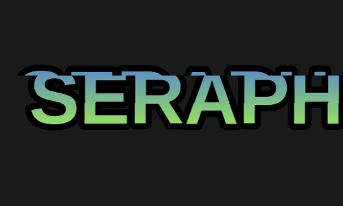

# Wobbly Text Generator

A fun interactive web application that generates glitch-style wobbly text animations with customizable text input.

## Features

- Type custom text (up to 10 characters)
- Real-time wave animation effect
- Colorful gradient text with black stroke outline
- Download animations as animated GIF files
- Retro pixelated canvas rendering

## How to Use

1. Open `wobbler.html` in a web browser
2. Enter your desired text in the input field (max 10 characters)
3. Click UPDATE to apply the text
4. Watch the wobbly animation play automatically
5. Click DOWNLOAD GIF to save the animation as an animated GIF file

## Technical Details

- Built with HTML5 Canvas API
- Uses gif.js library for GIF encoding
- Wave animation powered by sine wave mathematics
- 10 FPS animation speed for retro effect
- Canvas size: 500x300 pixels

## File Structure

- `wobbler.html` - Main application file containing HTML, CSS, and JavaScript

## Dependencies

- gif.js 0.2.0 (CDN: https://cdn.jsdelivr.net/npm/gif.js@0.2.0/dist/gif.js)

## Browser Compatibility

Works in all modern browsers that support:
- HTML5 Canvas
- JavaScript ES6
- Fetch API (for external script loading)
